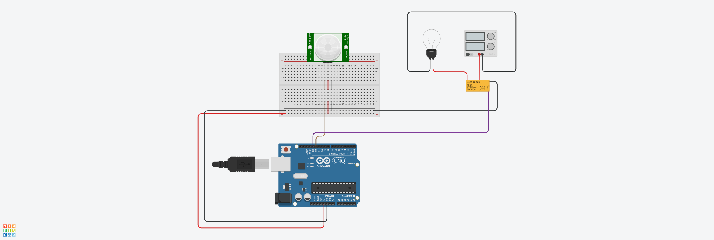

# laboratório 10

```c++
int RLY_PIN = 13;
int PIR_PIN = 12;

void setup()
{
  pinMode(RLY_PIN, OUTPUT);
  pinMode(PIR_PIN, INPUT);
}

void loop()
{
  int pir_state = digitalRead(PIR_PIN);

  if (pir_state == HIGH) {
    digitalWrite(RLY_PIN, HIGH);
  } else {
  	digitalWrite(RLY_PIN, LOW);
  }

  delay(1000);
}
```

