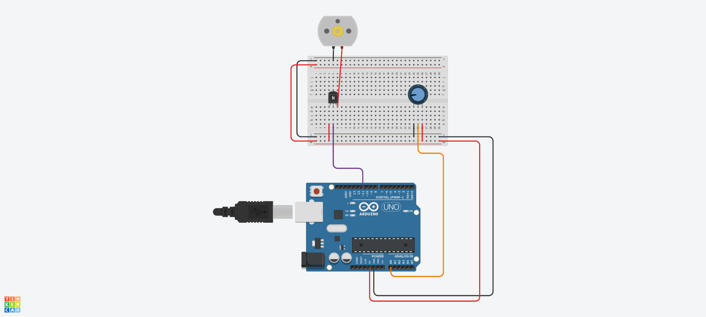

# laboratório 12

```c++
int POT_PIN = A0;
int MOT_PIN = 11;

void setup() {
  pinMode(MOT_PIN, OUTPUT);
}

void loop() {
  int curr_pot = map(analogRead(POT_PIN), 0, 1023, 0, 255);

  analogWrite(MOT_PIN, curr_pot);

  delay(1000);
}
```

