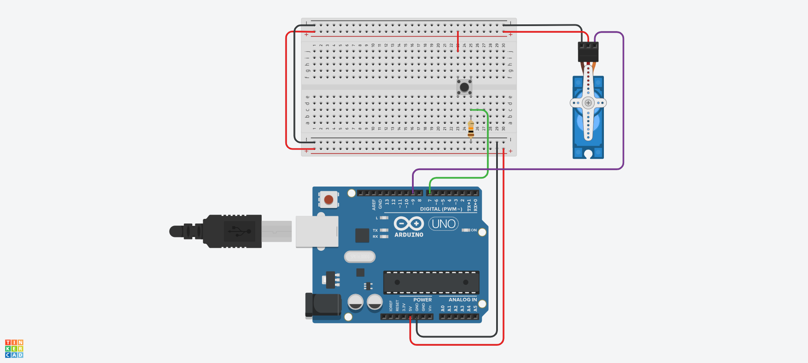

# laboratório 13

```c++
#include <Servo.h>

int BTN_PIN = 7;
int SRV_PIN = 9;

Servo servo;

void setup() {
  servo.attach(SRV_PIN, 500, 2500);
  servo.write(0);

  pinMode(BTN_PIN, INPUT);
}

void loop() {
  int btn_state = digitalRead(BTN_PIN);

  if (btn_state == HIGH) {
  	servo.write(90);
    delay(8000);
  } else {
  	servo.write(0);
  }

  delay(1000);
}
```

