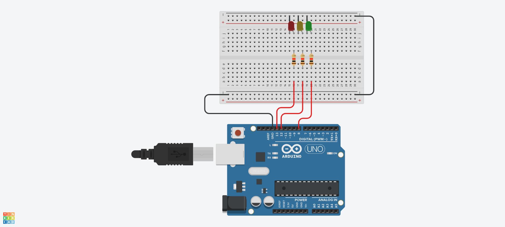

# laboratório 4

```c++
const int RED_PIN = 13;
const int YELLOW_PIN = 12;
const int GREEN_PIN = 8;

bool is_on = true;

void setup() {
  pinMode(RED_PIN, OUTPUT);
  pinMode(YELLOW_PIN, OUTPUT);
  pinMode(GREEN_PIN, OUTPUT);
}

void loop() {
  if (is_on) {
    digitalWrite(RED_PIN, LOW);
    digitalWrite(YELLOW_PIN, LOW);
    digitalWrite(GREEN_PIN, HIGH);
  } else if (!is_on) {
    digitalWrite(RED_PIN, LOW);
    digitalWrite(YELLOW_PIN, HIGH);
    digitalWrite(GREEN_PIN, LOW);

    delay(5000);

    digitalWrite(RED_PIN, HIGH);
    digitalWrite(YELLOW_PIN, LOW);
    digitalWrite(GREEN_PIN, LOW);
  }

  is_on = !is_on;

  delay(3000);
}
```

