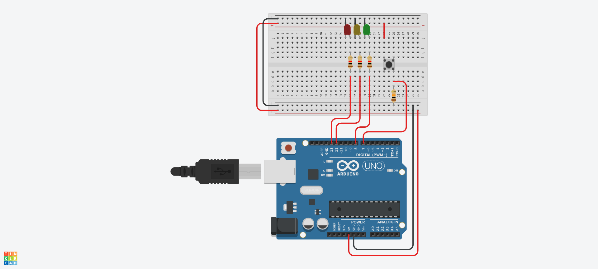

# laboratório 5

```c++
const int BUTTON_PIN = 7;

const int RED_PIN = 13;
const int YELLOW_PIN = 12;
const int GREEN_PIN = 8;

bool is_on = true;
int button_state = LOW;

void setup() {
  Serial.begin(9600);
  pinMode(BUTTON_PIN, INPUT);

  pinMode(RED_PIN, OUTPUT);
  pinMode(YELLOW_PIN, OUTPUT);
  pinMode(GREEN_PIN, OUTPUT);
}

void turn_red() {
  digitalWrite(RED_PIN, HIGH);
  digitalWrite(YELLOW_PIN, LOW);
  digitalWrite(GREEN_PIN, LOW);
}

void turn_yellow() {
  digitalWrite(RED_PIN, LOW);
  digitalWrite(YELLOW_PIN, HIGH);
  digitalWrite(GREEN_PIN, LOW);
}

void turn_green() {
  digitalWrite(RED_PIN, LOW);
  digitalWrite(YELLOW_PIN, LOW);
  digitalWrite(GREEN_PIN, HIGH);
}

void loop() {
  button_state = digitalRead(BUTTON_PIN);

  if (is_on && button_state == LOW) {
    turn_green();
  } else if (!is_on && button_state == LOW) {
    turn_yellow();
    delay(5000);
    turn_red();
  } else if (button_state == HIGH) {
  	turn_red();
  }

  is_on = !is_on;

  delay(3000);
}
```

