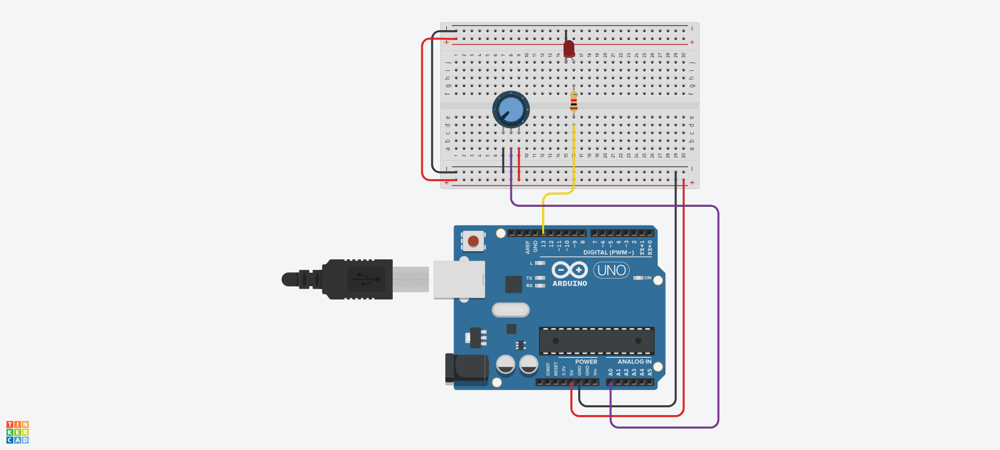

# laboratório 6

```c++
const int ANALOG_PIN = A0;
const int LED_PIN 	 = 13;

void setup() {
  Serial.begin(9600);
  pinMode(LED_PIN, OUTPUT);
}

void loop() {
  int power_value = analogRead(ANALOG_PIN);
  analogWrite(LED_PIN, map(power_value, 0, 1023, 0, 255));
  delay(1000);
}
```

